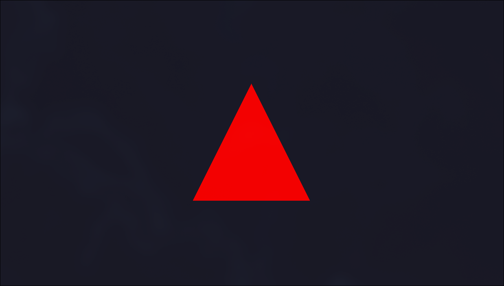

## Crucible

what is it...

well it's a vulkan rendering "game engine" its for like project i would like to 
rendering like 2D & 3D.



## What have i done?

- made vulkan rendering (malti-threading).
- made Entity Component System (not finished)

## How to build?

you need: ninja, cmake, vulkan 1.3+, glfw 3.3

In project past and i should run:
``` bash
cmake -B build -G Ninja && ninja -C build && ./build/Crucible
```

## im working on:
- ECS

## coding style 

- Data Types     | eg. structs, class ...| Pascal_Case
- Varables       | eg. uint, float ...   | snake_case

- namespace      | n_prefix 
- member         | m_prefix


