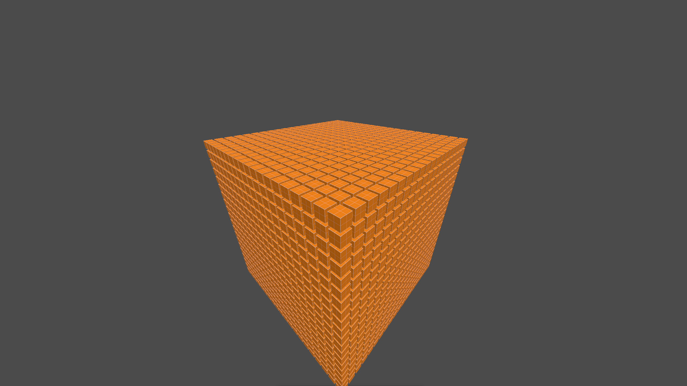

> [!WARNING]
> The library is not in production ready state yet.

Crucible is a library for one who is looking for a way to program games or anything to do with 
rendering to the screen in c++.
Crucible is very inspired by Entt, Bevy and raylib.

> Note: runnig at ~2.6k fps on arch linux release build on debug build its ~260fps, with 8k cubes.

## Features
- 3D Rendering
- ECS
- Model loading in .glb file format 
- same model auto batching

## Requirment To Run 
- Vulkan SDK
- Ninja 
- CMake
- Git
- C++ 23/26 
> **Note** there is install scripts in install/ for both linux and windows 10+, unfortunaly by windows compiler MSVC only support c++ 23 so might break.

## Goal
My goal is to make a lib that can easily be use by anyone who is willing to code in cpp.
Make cool rendering stuff.

10,000 object in one scene at 120fps on the specifired [specs](./docs/target_specs.md).
Lua based ui layer for like life and sanity.

currently for the app is running at 5k fps.

## How To Get Started
As of current the is not alot of Examples but soon to come...

## Install?
install scripts are in install/ for windows and linux.

## Progression and soon to come features
check [Progression](./docs/progressing_path.md) for info on what is happneing and what is planned.
## LLMS
I use LLMS for speed of development, for explinations on subject that im not preficiant in any and all code is written by me exept.
LLMS are used for stress testing code.

## Resource
This is a learing project in some respecs i have a [Resource](./docs/resources.md) of most or all websites i use to grasp cpp and vulkan development.

## License
Copyright (c) 2026 tsundoku-white 
Licensed under the MIT License. See [LICENSE](./docs/license) for details.
